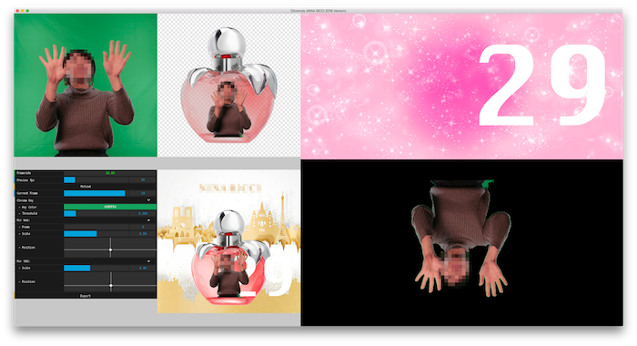

Chromoly
========

Package for chroma key compositing with oF.

    +-----+-----+---------+
    | RAW | WEB |         |
    +-----+-----+ ANDROID +
    | GUI | SNS |         |
    +-----+-----+---------+

Table of Contents
--------

- [Requirements](#requirements)
- [How to Setup](#how-to-setup)
	- [1. openFrameworks](#1-openframeworks)
	- [2. Automator](#2-automator)
		- [2.1 Pre process](#21-pre-process)
			- [2.1.1 Resize](#211-resize)
		- [2.2 Post process](#22-post-process)
			- [2.2.1 Convert to mp4](#221-convert-to-mp4)
			- [2.2.2 Upload to AWS S3](#222-upload-to-aws-s3)
			- [2.2.3 Print QR code](#223-print-qr-code)
	- [3. Camera Utility (Canon)](#3-camera-utility-canon)
		- [3.1 Resolution](#31-resolution)
		- [3.2 Export setting](#32-export-setting)
		- [3.3 Shooting](#33-shooting)
- [How to Use](#how-to-use)
  - [Keyboard shortcut](#keyboard-shortcut)
  - [Option](#option)
- [Contributes](#contributes)

## Requirements
- Mac OS 10.11 or higher
- Xcode 8.1 or higher
- [openFrameworks](http://openframeworks.cc) 0.98 or higher
- [Homebrew](http://brew.sh)
    - [ImageMagick](http://www.imagemagick.org/)
    - [FFmpeg](https://www.ffmpeg.org)
    - [S3cmd](http://s3tools.org/s3cmd)
    - [QREncode](http://fukuchi.org/works/qrencode/)

## How to Setup
### 1. openFrameworks
1. Download openFrameworks latest osx release version.
1. Change direcotory to `myApps` and clone this repository.
1. Add `+x` to `setup.sh` and execute it.
1. It will install some addons to appropriate path.

### 2. Automator

#### 2.1 Pre process

##### 2.1.1 Resize

#### 2.2 Post process

##### 2.2.1 Convert to mp4
`ffmpeg -r 10 -i android_%03d.png -c:v libx264 -pix_fmt yuv420p -vf "scale=trunc(iw/2)*2:trunc(ih/2)*2" android_yuv420p.mp4`

##### 2.2.2 Upload to AWS S3

##### 2.2.3 Print QR code
`lpr -P Brother_QL-700 -o media=DC17 ~.png`

- DC17 = 39x48mm
- DC03 = 29x90mm
- DC08 = 29x42mm

### 3. Camera Utility (Canon)

#### 3.1 Resolution
* It doesn't need RAW files
* Set "S2" to approx 2K x 2K

#### 3.2 Export setting
* Set import direcotory correctry like "import"
* Set rename setting to "<Shooting Time>|<Image Number>" like 1742480001.jpg

#### 3.3 Shooting
* Take continuous photos more than final movie rate

## How to Use

1. Push "Reload" button to target images
1. Choose chroma key color
    * Use color picker
    * Right click inside TOP-LEFT area
1. Adjust chromakey threshold
    * Use slider
    * Use UP / DOWN key
1. Adjust frame number, scale and position for WEB
    * User slider or LEFT / RIGHT key to choose the frame number which will be WEB image
    * Use slider to adjust scale
    * Use 2D pad to adjust position
1. Adjust scale and position for SNS
    * Use slider to adjust scale
    * Use 2D pad to adjust position
1. Push "Export" button to export synthesized images

### Keyboard shortcut

- b
    - Reload **B**ackground images
- l / r / t
    - **R**e**L**oad **T**arget images
- e
    - **E**xport synthesized images

### Option
* You can change preview framerate
    * User slider
    * If it was set '0', Chromoly will try to render as quick as possible

## Contributes
- Shin'ichiro SUZUKI (CEO / [szk-engineering](https://szk-engineering.com/))
